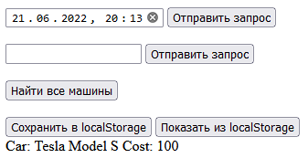
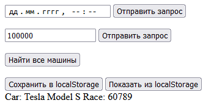
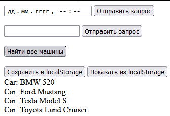

Жукова Анастасія КІУКІ-19-5  Вариант №6

Вариант 6. Создать и заполнить БД пункта проката автомобилей. В базе представлены две коллекции - коллекция документов, описывающая аренду (дата начала и завершения, стоимость аренды и марка машины), и коллекция, содержащая документы, которые описывают имеющиеся в пункте проката автомобили (марка, год выпуска, пробег, состояние (возможное поле)). Для хранения даты и времени в БД рекомендуется использовать формат Unix Timestamp.
Предоставить пользователю возможность получения следующей информации:
- полученный доход с проката по состоянию на выбранную дату;
- автомобили с пробегом меньше указанного;
- имеющиеся в данном пункте марки автомобилей.

---

> Полученный доход с проката по состоянию на выбранную дату;

---

> Автомобили с пробегом меньше указанного

---

> Имеющиеся в данном пункте марки автомобилей

---
> В localStorage сохраняются данные из блока "content" кнопкой "Сохранить в localStorage" и показываются соответствующей